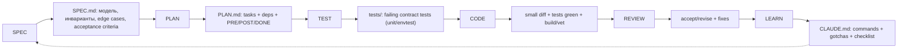
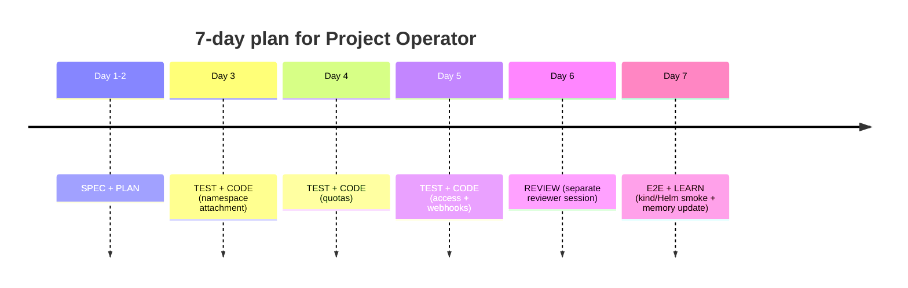

# Оценка презентации: воспроизводимый процесс разработки Kubernetes-оператора с LLM

Отвечу как архитектор platform engineering и член программных комитетов DevOps‑конференций, рецензирующий доклады про Kubernetes Operators и AI‑assisted development.

## Executive summary

Презентация хорошо попадает в цель: обучить аудиторию воспроизводимому циклу **SPEC → PLAN → TEST → CODE → REVIEW → LEARN** на нетривиальном примере Kubernetes‑оператора (CRD, reconcile loop, admission webhooks, finalizers, RBAC, envtest, Helm/CI). Это рациональный кейс: контроллеры — control loops, непрерывно приводящие текущее состояние к desired state. citeturn1search1

Сильные стороны: (1) у этапов есть вход/выход и критерий качества; (2) тестовый контракт до реализации; (3) разведение implementer/reviewer; (4) CLAUDE.md как project memory; (5) 7‑дневный таймлайн. Риски: доказательность пока “кейс‑описание”, а не измерения; есть несколько перегруженных/служебных слайдов (если их показать на экране — упадёт читабельность).

Анализ сделан по текстовой версии слайдов (48 слайдов) из предоставленного markdown; визуальный слой PPTX оценён косвенно.

## Оценка по критериям программного комитета

**Актуальность — 9.5/10.** Kubernetes/operators + AI‑assisted engineering; фокус на процессе снижает устареваемость.

**Практическая ценность — 9.0/10.** Промпты, чек‑листы, критерии качества, “красные флаги”.

**Воспроизводимость метода — 8.8/10.** Есть “Input → Output → Quality”. Чтобы довести до 9.5+, нужно жестче нормировать артефакты (имена файлов/директорий) и показать 1 эталонный фрагмент SPEC/PLAN/теста.

**Доказательность — 6.5/10.** Таймлайн на 7 дней есть, но мало измеримых метрик качества/скорости. Упоминания auto‑review без демонстрации — **частично обосновано**.

**Сценичность/читабельность — 8.0/10.** Нарратив сильный, но 2–3 слайда перегружены. Если блоки “Что сказать голосом” находятся на слайдах, а не в speaker notes — это заметный минус.

**Риск хайпа/переобещания — 3/10 (0=низкий, 10=высокий).** “LLM = второй пилот” и явные quality gates держат риск низким; поднять его может некорректное чтение “7 дней” как обещания.

## Практическая воспроизводимость цикла и артефактов

В Kubernetes контроллеры должны быть идемпотентными; это best practice для операторов и reconcile‑loop. citeturn1search2 Для операторов также критичны delete‑ветки (finalizers) и входная валидация (admission webhooks), поэтому “контракт до кода” особенно оправдан. citeturn0search0turn0search1turn1search5



envtest — практичный “интеграционный контракт” для контроллеров: локальный apiserver+etcd без kubelet/CM. citeturn0search3turn0search11

### Входы, выходы и quality gates по этапам

| Этап | Вход | Выход (артефакт) | Quality gate (коротко) |
|---|---|---|---|
| SPEC | бизнес‑задача, ограничения | `SPEC.md` | 2 инженера одинаково понимают behavior |
| PLAN | утверждённый SPEC | `PLAN.md` | задачи независимы и проверяемы |
| TEST | SPEC + task id | `tests/` (failing) | тесты про модель, не про реализацию |
| CODE | PLAN + tests | small diff + green CI | tests/build/vet проходят; spec gaps фиксируются вопросом |
| REVIEW | diff + tests + constraints | accept/revise + fixes | ловит semantic bugs, не стиль |
| LEARN | опыт шага + баги + решения | `CLAUDE.md`/checklists | память уменьшает повтор ошибок |

### Сравнение: текущая версия vs рекомендованная

| Этап | Текущее состояние | Рекомендованное улучшение | Приоритет |
|---|---|---|---|
| SPEC | I/O + шаблон + Devil’s Advocate | Явно назвать `SPEC.md`; добавить 1 мини‑пример acceptance criteria | Средний |
| PLAN | Декомпозиция + PRE/POST + prompt | Ввести “task id”; правило: *1 задача = 1 контракт + 1 PR* | Высокий |
| TEST | Tests‑before‑code, отдельная сессия | Усилить prompt: сценарии + “что не покрыто”; подчеркнуть envtest | Высокий |
| CODE | Реализация контракта + контекст | Усилить prompt: plan→code, diff small, запрет менять spec/tests молча | Высокий |
| REVIEW | Есть вход/выход, есть развод ролей | Сжать слайд: схема + checklist; авто‑ревью/ссылки в notes | Высокий |
| LEARN | CLAUDE.md + что фиксировать | Правило: обновлять память **после accept**; добавить decision log | Средний |



## Доказательность: 5 метрик/артефактов для сцены

1) **Дерево репозитория артефактов**: `SPEC.md`, `PLAN.md`, `CLAUDE.md`, `tests/` (скрин).  
2) **Test‑first coverage**: доля задач, где `contract(task‑XX)` раньше `impl(task‑XX)` (git log по шаблону сообщений).  
3) **Median diff per task/PR**: `git show --stat`/PR stats; цель — reviewable (например, <200 строк).  
4) **Семантические дефекты, снятые REVIEW**: счётчик “issues before merge” (PR comments или `REVIEW.md`). Утверждения “авто‑ревью нашло баги” без скрина/примера пометить как **необосновано**.  
5) **Cycle time per task**: от “task выбран” до “accept” (таймстемпы PR/коммитов), показывать распределение, а не один “7 дней”.

## Слайд‑за‑слайдом правки и визуалы

Примечание: все блоки “Что сказать голосом” — в speaker notes (на экране не показывать).

Формат: **Сx «Заголовок»** — Роль; Оставить; Убрать; Текст (copy‑paste); Визуал+приоритет.

С1 «Титульный» — хук; заголовок+автор; служебные заметки; **Текст:** «Kubernetes‑операторы с LLM: цикл SPEC→PLAN→TEST→CODE→REVIEW→LEARN»; Виз: не нужно.  
С2 «Для кого» — таргетинг; 4 пункта; —; **+Текст:** «Если LLM даёт хаос на сложных системах — вы по адресу»; Виз: иконки (жел.).  
С3 «Проблема» — боль; ключевой тезис; 1–2 дубли; **Текст:** «потеря модели / большие diff / неверные решения / ложная скорость»; Виз: 4 иконки (жел.).  
С4 «О чём» — контракт; цикл+кейс; лишние детали; **Текст:** «Итог: воспроизводимая схема, а не вдохновение»; Виз: не нужно.  
С5 «Project Operator» — объект; ресурсы+функции; —; **+Текст:** «Project‑level quota сложнее namespace‑quota»; Виз: схема сущностей (обяз.). citeturn0search2  
С6 «Оператор — проверка» — мотивация; список сложностей; —; **+Текст:** «Reconcile обязан быть идемпотентным»; Виз: 2 колонки (жел.). citeturn1search2  
С7 «Что унести» — outcomes; пункты; —; **Текст:** укоротить до 4 (spec/contract/sessions/memory); Виз: не нужно.  
С8 «Наивный подход» — антипример; запрос+итог; 2 вторичных пункта; **+Текст:** «Большой diff = непроверяемость»; Виз: причинная цепочка (жел.).  
С9 «Инсайт» — тезис; 2 потока; —; **+Текст:** «LLM усиливает процесс, не заменяет его»; Виз: 2 lane (обяз.).  
С10 «Схема» — опорная карта; цикл; список “вход/выход…”; **Текст (замена):** «Рекомендуемый стартовый порядок (не жёсткая линейность)\nИтеративный цикл с возвратами — норма\nКаждый переход — решение человека\nLLM не идёт дальше без явного accept»; Виз: цикл с обратными стрелками (обяз.).  
С11 «Как читать» — шаблон; 5 пунктов; —; **Текст:** без изменений; Виз: 5‑карточек (жел.).  
С12 «SPEC зачем» — старт; I/O; —; **+Текст:** «Артефакт: SPEC.md»; Виз: cards (жел.).  
С13 «SPEC пример» — конкретика; инварианты; —; **+Текст:** 1 строка acceptance criteria; Виз: не нужно.  
С14 «Шаблон SPEC» — структура; список; —; **Текст:** без изменений; Виз: не нужно.  
С15 «Prompt SPEC» — шаблон; prompt; —; **Текст:** без изменений; Виз: не нужно.  
С16 «Devil’s Advocate» — контр‑проверка; список; ссылки/детали; **Текст:** «Независимый критик = другая сессия/модель»; Виз: не нужно.  
С17 «Quality SPEC» — gate; критерии; —; **Текст:** без изменений; Виз: чек‑лист (жел.).  
С18 «PLAN зачем» — старт; I/O; —; **+Текст:** «Артефакт: PLAN.md + task id»; Виз: не нужно.  
С19 «Задача+готовность» — атом; примеры; —; **Текст:** «Task contract: What→Done»; Виз: таблица 2 колонки (обяз.).  
С20 «PLAN пример» — проход задач; tests→impl; scaffold‑детали; **Текст:** «Per task: tests→impl→review»; Виз: мини‑канбан (жел.).  
С21 «PRE/POST» — контракт; пример; —; **+Текст:** «DONE = тест на POST»; Виз: 2‑колонка (жел.).  
С22 «Prompt PLAN» — шаблон; prompt; —; **Текст:** без изменений; Виз: не нужно.  
С23 «Quality PLAN» — gate; критерии; —; **Текст:** без изменений; Виз: не нужно.  
С24 «TEST зачем» — контракт; I/O; —; **+Текст:** «envtest = интеграционный контракт»; Виз: stamp (жел.). citeturn0search3  
С25 «TDD поток» — рецепт; 4 шага; длинные оговорки; **+Текст:** «Человек валидирует тесты перед коммитом»; Виз: 4‑step flow (обяз.).  
С26 «Prompt TEST» — копипаст; идея; короткий prompt; **Текст (замена целиком):** (см. блок ниже); Виз: не нужно.  
С27 «Что тестировать» — coverage; список; —; **+Текст:** «Webhooks: low latency, no side effects»; Виз: иконки (жел.). citeturn2view0  
С28 «Quality TEST» — gate; критерии; —; **Текст:** без изменений; Виз: не нужно.  
С29 «CODE контракт» — ограничение; I/O; —; **+Текст:** «diff small & reviewable»; Виз: не нужно.  
С30 «Context Engineering» — память; мысль; —; **Текст:** без изменений; Виз: дерево файлов (жел.).  
С31 «CLAUDE.md» — шаблон; команды/gotchas; —; **Текст:** заменить gotcha на «Webhooks: low latency, few API calls, no side effects»; Виз: не нужно. citeturn2view0  
С32 «Prompt CODE» — копипаст; идея; короткий prompt; **Текст (замена целиком):** (см. блок ниже); Виз: не нужно.  
С33 «Quality CODE» — gate; критерии; —; **+Текст:** «Идемпотентность подтверждена тестами»; Виз: не нужно. citeturn1search2  
С34 «REVIEW зачем» — wall; I/O; —; **Текст:** без изменений; Виз: не нужно.  
С35 «Развести роли» — паттерн; 2 сессии + git worktree; длинный prompt/ссылки/auto‑review; **Текст (замена):** «Чек‑лист ревью: соответствие SPEC; идемпотентность; RBAC scope; delete/finalizers; webhook latency; quota safety; решение accept/revise»; Виз: 2 терминала + git diff (обяз.). citeturn1search3turn0search0turn2view0  
С36 «Hooks» — базовый слой; список; “gopls gotcha”; **Текст:** добавить «Hooks ≠ review»; Виз: иконки (жел.).  
С37 «Quality REVIEW» — gate; критерии; —; **Текст:** без изменений; Виз: не нужно.  
С38 «LEARN зачем» — устойчивость; I/O; —; **+Текст:** «Обновлять после accept»; Виз: не нужно.  
С39 «Что фиксировать» — содержание; 5 пунктов; длинный prompt; **Текст (замена):** «Update CLAUDE.md: Gotchas + Checklist + Decisions»; Виз: не нужно.  
С40 «Quality LEARN» — gate; критерии; —; **Текст:** без изменений; Виз: не нужно.  
С41 «Pipeline артефактов» — сборка; mapping; —; **Текст:** заменить на диаграмму (flowchart); Виз: flowchart (обяз.).  
С42 «7 дней» — кейс; по дням; “final checks”; **Текст:** заменить на «kind smoke test; helm install/upgrade; зелёный CI; обновить CLAUDE.md»; Виз: timeline (обяз.).  
С43 «Где работает» — границы; good/bad; —; **+Текст:** «Первый заход — задача 1–2 недели, не “перепиши всё”»; Виз: 2 колонки (жел.).  
С44 «Анти‑паттерны» — guardrails; список; 2 частных пункта; **Текст:** оставить 6 ключевых анти‑паттернов; Виз: красные карточки (жел.).  
С45 «Что делать завтра» — CTA; список; —; **+Текст:** «Не используйте LLM без spec+contract+review»; Виз: не нужно.  
С46 «Вывод» — финал; тезисы; —; **+Текст:** «Процесс > модель > prompt»; Виз: не нужно.  
С47 «Запомнить» — 3 правила; список; —; **Текст:** без изменений; Виз: не нужно.  
С48 «Спасибо» — контакты; имя/ник/QR; служебные блоки; **Текст:** «Материалы: repo + шаблоны SPEC/PLAN/CLAUDE.md (QR)»; Виз: QR (обяз.).

Текст для С26 (замена целиком):

```text
Напиши envtest тесты для task-07 из PLAN.md.

Правила:
- сценарии брать только из acceptance criteria в SPEC.md
- писать только тесты
- reconciler не реализовывать
- тесты должны выражать expected behavior, а не детали реализации
- тесты должны компилироваться, но падать

Выведи:
1) список сценариев
2) сами тесты
3) какие части контракта пока не покрыты
```

Текст для С32 (замена целиком):

```text
Реализуй task-07 из PLAN.md: quota reconciliation.

Контекст:
- SPEC.md зафиксирован
- тесты уже написаны и падают
- acceptance criteria менять нельзя

Правила:
- сначала коротко опиши план реализации (5–10 строк)
- реализация должна пройти существующие тесты
- если видишь пробел в spec — остановись и сформулируй вопрос
- не меняй тесты, если это не явная ошибка в контракте
- держи diff маленьким и reviewable (например, <200 строк)

Выведи: план, затем код/patch
```

## Приоритетизация и ответы программному комитету

### Топ‑5 срочных изменений

1) С10: оставить цикл + 4 строки про human gates/accept.  
2) С26: расширить prompt TEST (сценарии + непокрытое).  
3) С32: расширить prompt CODE (plan→code, diff small, spec immutable).  
4) С35: упростить до схемы 2 сессий + review checklist; остальное в notes.  
5) С48: убрать служебные блоки, оставить контакты+QR.

### Возможные вопросы ПК и ответы

**Почему тесты до кода и отдельная сессия?** Чтобы тесты описывали expected behavior и не подгонялись под реализацию; критично для webhooks/quotas/RBAC. citeturn2view0turn0search2turn1search6  
**Как тестируете оператор реалистично?** envtest поднимает apiserver+etcd и проверяет reconcile на реальных ресурсах/CRD. citeturn0search3turn0search11  
**Как обращаетесь с delete/finalizers?** Это отдельные сценарии в SPEC/TEST; finalizer снимается только после cleanup. citeturn0search0turn1search5  
**Что вы называете “production operator”?** “Production” = есть delete‑логика (finalizers), admission/валидация, RBAC least‑privilege, envtest и CI gates; иначе это demo. citeturn0search0turn2view0turn1search6  
**“7 дней” — это обещание?** Нет, это кейс при фиксированном scope; на сцене показывается cycle time задач и артефакты, а не “магия AI”.